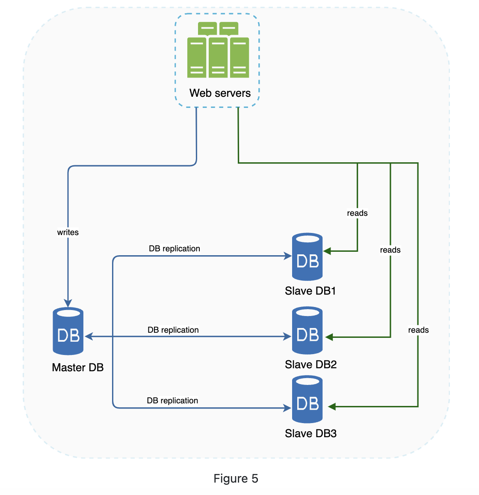
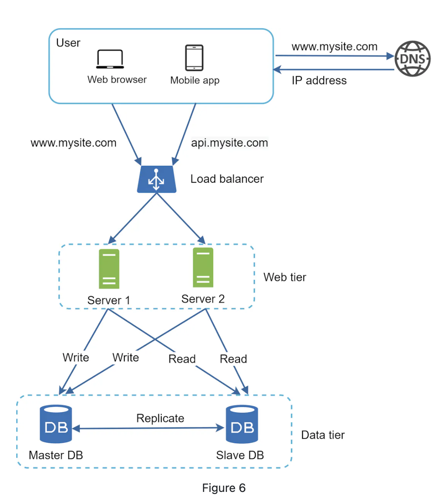

# Database Replication Notes

## Key Points and Keywords:

### 1. Master/Slave Relationship

**Master Database:** Supports write operations (insert, delete, update).

**Slave Database:** Receives copies of data from the master and supports read operations.

### 2. Performance
**Read Operations:** Distributed across slave nodes, improving performance by parallel processing of queries.

### 3. Reliability

**Data Preservation:** Data replicated across multiple locations prevents data loss in case of disasters.

### 4. High Availability

**Operation Continuity:** Website remains operational even if one database goes offline, as data can be accessed from another server.

### 5. Handling Offline Databases

**Single Slave Offline:** Read operations temporarily redirected to the master.
**Multiple Slaves:** Read operations redirected to other slave databases.
**Master Offline:** A slave is promoted to master; new slave database replaces the old one.

### 6. Figure 6

**Load Balancer Role:** Directs HTTP requests to web servers.
**Web Server Operations:** Reads data from slave databases and routes data-modifying operations to the master.

