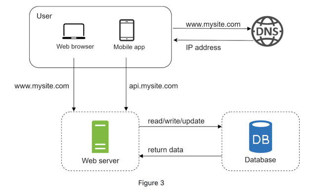

# Database

To accommodate a growing user base, multiple servers are necessary, with one dedicated to the **database (data tier)** and another to handle **web/mobile traffic (web tier)**. This separation enables independent scaling of each tier. 

### Relational Databases vs Non-Relational Databases

#### Relational Databases
- Also known as relational database management systems (RDBMS) or SQL databases.
- Popular examples include MySQL, Oracle DB, PostgreSQL.
- Data is structured and stored in tables and rows.
- SQL allows for performing join operations across different tables.

#### Non-Relational Databases
- Also referred to as NoSQL databases.
- Popular examples include CouchDB, Neo4j, Cassandra, HBase, Amazon DynamoDB.
- Categorized into **key-value stores, graph stores, column stores, and document stores.**
- Join operations are generally not supported.

### Choosing between NoSQL and RDBMS
NoSQL databases are preferred if the application:

- Requires extremely low latency.
- Deals with unstructured or non-relational data.
- Only needs to serialize and deserialize data (e.g., JSON, XML, YAML).
- Needs to handle massive data storage requirements.