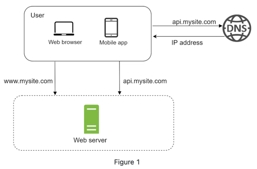
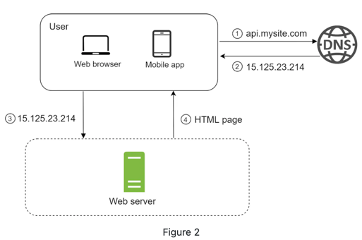

# Single Server Setup

Building a complex system begins with a single step: setting up a single server.

Starting with simplicity, all components run on one server:
- Web application,
- Database,
- Cache, and so forth.

